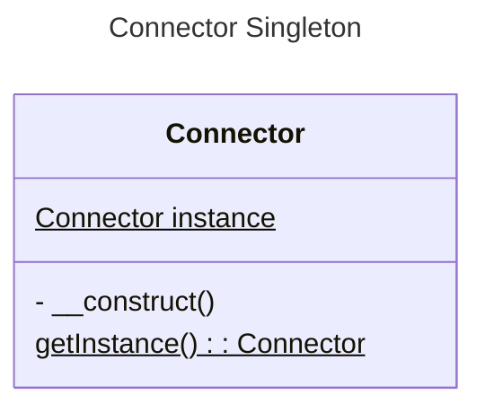
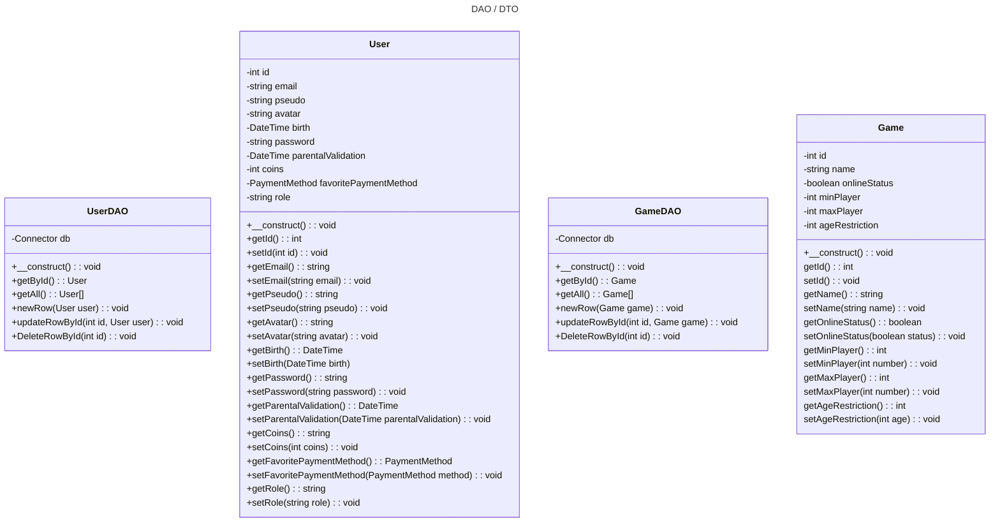

# Game Project
## Connector

```mermaid
---
title: Connector Singleton
---
classDiagram
class Connector {
    Connector instance$
    - __construct()
    getInstance()$ : Connector
}
```

```mermaid
---
title: DAO / DTO
---
classDiagram

class UserDAO {
    -Connector db
    +__construct(): void
    +getById(): User
    +getAll(): User[]
    +newRow(User user): void
    +updateRowById(int id, User user): void
    +DeleteRowById(int id): void
}

class User {
    -int id
    -string email
    -string pseudo
    -string avatar
    -DateTime birth
    -string password
    -DateTime parentalValidation
    -int coins
    -PaymentMethod favoritePaymentMethod
    -string role

    +__construct(): void

    +getId(): int
    +setId(int id): void
    +getEmail(): string
    +setEmail(string email): void
    +getPseudo(): string
    +setPseudo(string pseudo): void
    +getAvatar(): string
    +setAvatar(string avatar): void
    +getBirth(): DateTime
    +setBirth(DateTime birth)
    +getPassword(): string
    +setPassword(string password): void
    +getParentalValidation(): DateTime
    +setParentalValidation(DateTime parentalValidation): void
    +getCoins(): string
    +setCoins(int coins): void
    +getFavoritePaymentMethod(): PaymentMethod
    +setFavoritePaymentMethod(PaymentMethod method): void
    +getRole(): string
    +setRole(string role): void
}

class GameDAO {
    -Connector db
    +__construct(): void
    +getById(): Game
    +getAll(): Game[]
    +newRow(Game game): void
    +updateRowById(int id, Game game): void
    +DeleteRowById(int id): void
}

class Game {
    -int id
    -string name
    -boolean onlineStatus
    -int minPlayer
    -int maxPlayer
    -int ageRestriction

    +__construct(): void

    getId(): int
    setId(): void
    getName(): string
    setName(string name): void
    getOnlineStatus(): boolean
    setOnlineStatus(boolean status): void
    getMinPlayer(): int
    setMinPlayer(int number): void
    getMaxPlayer(): int
    setMaxPlayer(int number): void
    getAgeRestriction(): int
    setAgeRestriction(int age): void
}
```